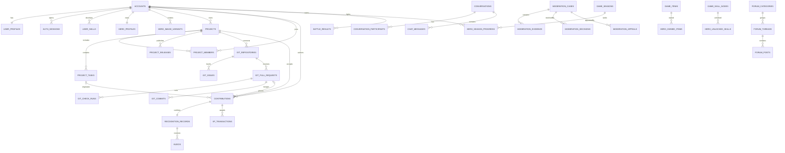

# Укрупнённая ER-диаграмма

```mermaid
erDiagram
  ACCOUNTS ||--|| USER_PROFILES : has
  ACCOUNTS ||--o{ AUTH_SESSIONS : opens
  ACCOUNTS ||--o{ USER_SKILLS : develops
  ACCOUNTS ||--|| HERO_PROFILES : owns
  ACCOUNTS ||--o{ HERO_IMAGE_VARIANTS : creates

  ACCOUNTS ||--o{ PROJECTS : owns
  PROJECTS ||--o{ PROJECT_MEMBERS : includes
  ACCOUNTS ||--o{ PROJECT_MEMBERS : joins
  PROJECTS ||--o{ PROJECT_TASKS : contains
  PROJECTS ||--o{ PROJECT_RELEASES : publishes

  PROJECTS ||--o{ GIT_REPOSITORIES : connects
  GIT_REPOSITORIES ||--o{ GIT_ISSUES : tracks
  GIT_REPOSITORIES ||--o{ GIT_PULL_REQUESTS : receives
  GIT_PULL_REQUESTS ||--o{ GIT_CHECK_RUNS : runs
  GIT_PULL_REQUESTS ||--o{ GIT_COMMITS : merges

  ACCOUNTS ||--o{ CONTRIBUTIONS : authors
  PROJECTS ||--o{ CONTRIBUTIONS : accepts
  PROJECT_TASKS o|--o{ CONTRIBUTIONS : originates
  GIT_PULL_REQUESTS o|--o{ CONTRIBUTIONS : proves
  CONTRIBUTIONS ||--|| RECOGNITION_RECORDS : confirms
  RECOGNITION_RECORDS ||--o{ KUDOS : receives
  CONTRIBUTIONS ||--o{ XP_TRANSACTIONS : awards

  FORUM_CATEGORIES ||--o{ FORUM_THREADS : groups
  FORUM_THREADS ||--o{ FORUM_POSTS : contains
  CONVERSATIONS ||--o{ CONVERSATION_PARTICIPANTS : has
  CONVERSATIONS ||--o{ CHAT_MESSAGES : contains

  MODERATION_CASES ||--o{ MODERATION_EVIDENCE : contains
  MODERATION_CASES ||--o{ MODERATION_DECISIONS : resolvedBy
  MODERATION_CASES ||--o{ MODERATION_APPEALS : appealedBy

  GAME_SEASONS ||--o{ HERO_SEASON_PROGRESS : ranks
  ACCOUNTS ||--o{ HERO_SEASON_PROGRESS : earns
  ACCOUNTS ||--o{ BATTLE_RESULTS : fights
  GAME_ITEMS ||--o{ HERO_OWNED_ITEMS : owned
  GAME_SKILL_NODES ||--o{ HERO_UNLOCKED_SKILLS : unlocked
```

Полный список из 74 таблиц находится в `schema-manifest.json`.
